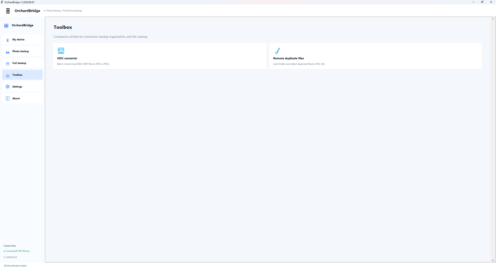
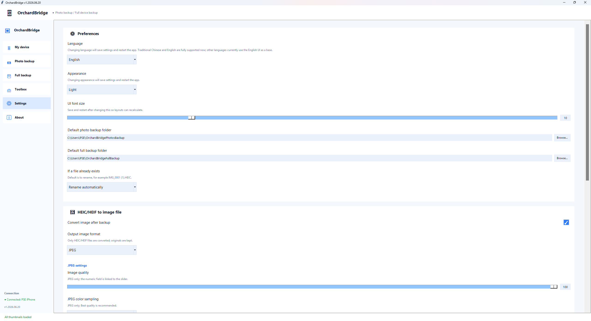

# OrchardBridge

**OrchardBridge** is a portable Windows desktop tool for backing up photos, videos, and full-device data from USB-connected **iPhone / iOS devices** to local storage. It is designed for users who want a visual, local-first workflow: connect the iPhone, trust the computer, scan media, preview files, select what to keep, and back everything up to a Windows folder.

OrchardBridge focuses on iPhone backup workflows. It is **not** an Android backup tool.

> OrchardBridge is an independent project and is not affiliated with, endorsed by, or sponsored by Apple Inc. Apple, iPhone, iOS, and related names are trademarks of Apple Inc. They are mentioned here only to describe device compatibility and required system components. OrchardBridge does not use any third-party trademark as the product name.

---

## Main features

- **Photo and video backup from iPhone**  
  Scan media from a USB-connected iPhone, preview thumbnails, filter and sort files, select individual items or select everything, then copy them to a local backup folder.

- **Optional HEIC/HEIF conversion**  
  Convert HEIC/HEIF images to JPEG or PNG after backup. JPEG quality, subsampling, optimization, PNG compression, and conversion workers can be adjusted in Settings.

- **Full-device backup**  
  Start a broader iPhone backup workflow through `pymobiledevice3` for users who want more than photo/video export.

- **Built-in toolbox**  
  Includes a HEIC/HEIF converter and a duplicate-file cleaner. Both tools support multiple files and folders, recursive folder scanning, and path deduplication.

- **Local settings, cache, and logs**  
  Manage backup folders, cache behavior, original-file cache, thumbnail cache, runtime logs, and bug-report files.

- **Portable Windows workflow**  
  Normal users can run the single EXE. Developers or testers can run the source version with `run_conda.bat`.

- **Multi-language UI**  
  English is the default language. Additional language packs are included and can be selected in Settings.

---

## System requirements

### For the portable EXE

- Windows 10 or Windows 11.
- A USB-connected iPhone / iOS device.
- The iPhone must be unlocked, and **Trust This Computer** must be accepted when prompted.
- **Apple Mobile Device Support** must be installed and working.
- Enough local disk space for the selected backup destination.

The portable EXE bundles the Python runtime and required Python libraries. Normal users do not need to install Python.

### Apple Mobile Device Support is required

Windows File Explorer may show an iPhone under “This PC” even when OrchardBridge cannot connect to it. These are not the same connection layer.

OrchardBridge relies on the Apple Mobile Device / usbmux / lockdown connection path used by `pymobiledevice3`. If Apple Mobile Device Support is missing or broken, OrchardBridge may not detect the iPhone even if Windows Explorer can browse photos.

If the device is not detected, install or repair one of the following Apple components, then reconnect the iPhone and tap **Trust This Computer** again:

- **Apple Devices** for Windows, or
- **iTunes** for Windows, which usually includes Apple Mobile Device Support.

---

## Download

For most users, download the portable executable from GitHub Releases:

```text
https://github.com/dogs1231992/OrchardBridge/releases
```

Download the latest `OrchardBridge.exe`, place it anywhere you like, and run it directly.

---

## Quick start

1. Install or repair **Apple Mobile Device Support** if it is not already installed.
2. Connect your iPhone to the Windows PC with a USB cable.
3. Unlock the iPhone and tap **Trust This Computer** if prompted.
4. Start `OrchardBridge.exe`.
5. Open **Photo backup** and click **Scan photos**.
6. Select the photos and videos you want to back up.
7. Choose a backup folder.
8. Click **Start backup**.
9. Optional: enable HEIC/HEIF conversion after backup.

---

## Screenshots and workflow

### 1. My device

The **My device** page shows the connected iPhone name, model, iOS version, storage usage, and battery information when available. It also provides quick shortcuts to photo backup, full backup, settings, and project information.


### 2. Photo backup

Use **Photo backup** to scan media from the connected iPhone, preview thumbnails, filter and sort the results, select what you want to keep, and back up the selected files to a local folder.


### 3. Scan photos

After scanning, OrchardBridge displays detected media files with filenames, file sizes, selection status, and thumbnail previews. You can select everything, deselect everything, or manually choose individual files before starting the backup.


### 4. Full backup

The **Full backup** page provides a full-device backup workflow through `pymobiledevice3`. This is useful when you want a broader device backup in addition to photo and video export.


### 5. Toolbox

The **Toolbox** page includes standalone utilities:

- **HEIC/HEIF converter**: accepts multiple files and folders, scans folders recursively, keeps only `.heic` and `.heif` files, deduplicates normalized paths, and converts images to the selected output format.
- **Duplicate-file cleaner**: accepts files and folders of any format, scans recursively, groups files by SHA-256 hash, and helps remove duplicate copies safely.



### 6. Settings

The **Settings** page controls language, theme, font size, backup folders, HEIC/HEIF conversion, JPEG/PNG options, cache behavior, conflict handling, logs, and application behavior.



---

## Important UI note: font size and screen resolution

OrchardBridge supports UI font-size adjustment. However, if the font size is set very large on a low-resolution or small-screen device, some buttons or controls may extend beyond the visible area.

If the layout looks crowded:

- maximize the OrchardBridge window,
- reduce the UI font size in **Settings**,
- or use a display with higher resolution / scaling space.

The default font size is recommended for most users.

---

## Toolbox drag-and-drop notes

The HEIC/HEIF converter and duplicate-file cleaner support drag-and-drop from Windows File Explorer.

Supported behavior:

- Drag multiple files at once.
- Drag multiple folders at once.
- Folder inputs are scanned recursively.
- If a parent folder and one of its child folders are both added, duplicated file paths are detected and shown only once.
- HEIC/HEIF converter only keeps `.heic` and `.heif` files.
- Duplicate-file cleaner accepts all file formats.

Windows security note: drag-and-drop from File Explorer may fail if OrchardBridge is running as administrator while File Explorer is running normally. For daily use, run OrchardBridge in normal user mode.

---

## Running from source with `run_conda.bat`

For development or source-based testing, run:

```bat
run_conda.bat
```

The launcher creates a project-local `.venv` and installs dependencies into that isolated environment. It does not intentionally install packages into Anaconda base, system Python, or user site-packages.

Important notes for source runs:

- On some computers, the **first run** may need **Run as administrator** so Windows allows `.venv` creation and package installation.
- After `.venv` has been created successfully, close OrchardBridge and launch `run_conda.bat` again in **normal user mode**.
- Normal user mode is recommended for everyday testing. Windows may block drag-and-drop from File Explorer and may interfere with normal Print Screen / Snipping Tool behavior when an app is running elevated as administrator.
- `.venv` is reused on later runs. Dependencies are installed again only when `.venv` is missing, damaged, `requirements.txt` changes, or `ORCHARD_BRIDGE_REPAIR=1` is set.

Manual source setup is also possible:

```powershell
python -m venv .venv
.\.venv\Scripts\python.exe -m pip install --upgrade pip
.\.venv\Scripts\python.exe -m pip install --prefer-binary -r requirements.txt
.\.venv\Scripts\python.exe main.py
```

---

## Building the EXE yourself

The PyInstaller configuration is stored in:

```text
OrchardBridge.spec
```

The custom application icon is stored in:

```text
assets\orchardbridge_icon.ico
```

Build with:

```powershell
Set-ExecutionPolicy -Scope Process -ExecutionPolicy Bypass
.\build_onefile_exe.ps1
```

The final executable will be generated at:

```text
release\OrchardBridge.exe
```

The build script creates temporary folders such as `.build_venv`, `build`, and `dist`, and removes temporary build artifacts after a successful build.

---

## Data locations

- Default photo backup folder: `%USERPROFILE%\OrchardBridgePhotosBackup`
- Default full-device backup folder: `%USERPROFILE%\OrchardBridgeFullBackup`
- Settings: `%APPDATA%\OrchardBridge\settings.json`
- Cache: `%LOCALAPPDATA%\OrchardBridge\Cache`
- Original-file cache: `%LOCALAPPDATA%\OrchardBridge\Cache\originals`
- Thumbnail cache: `%LOCALAPPDATA%\OrchardBridge\Cache\thumbs`
- Logs: `%LOCALAPPDATA%\OrchardBridge\Logs`
- Bug reports: `%LOCALAPPDATA%\OrchardBridge\BugReports`

---

## Supported languages

Current UI language packs are AI-assisted draft translations and may still contain unnatural wording. Native-speaker corrections are welcome.

Bundled languages:

- English (`en-US`)
- Traditional Chinese (`zh-TW`)
- Simplified Chinese (`zh-CN`)
- Japanese (`ja-JP`)
- Korean (`ko-KR`)
- Spanish (`es-ES`)
- French (`fr-FR`)
- German (`de-DE`)
- Portuguese — Brazil (`pt-BR`)
- Russian (`ru-RU`)
- Thai (`th-TH`)
- Indonesian (`id-ID`)
- Arabic — Saudi Arabia (`ar-SA`)

---

## Troubleshooting

### OrchardBridge does not detect my iPhone

Try the following:

1. Unlock the iPhone.
2. Reconnect the USB cable.
3. Tap **Trust This Computer** on the iPhone if prompted.
4. Install or repair **Apple Devices** or **iTunes** for Windows so Apple Mobile Device Support is available.
5. Restart OrchardBridge.
6. Check the runtime logs under `%LOCALAPPDATA%\OrchardBridge\Logs`.

### Windows Explorer can see the iPhone, but OrchardBridge cannot

This usually means the Windows photo-browsing path is available, but the Apple Mobile Device / usbmux path required by OrchardBridge is not working. Install or repair Apple Mobile Device Support, then reconnect the iPhone.

### Drag-and-drop does not work

Run OrchardBridge in normal user mode. Windows may block dragging files from a normal File Explorer window into an administrator-mode application.

### The UI is too large or buttons are clipped

Reduce the UI font size in Settings, maximize the window, or use a higher-resolution display. Very large font sizes may not fit well on low-resolution screens.

---

## Feedback, bug reports, and feature requests

Bug reports and feature requests are welcome. If you encounter a problem, please open a GitHub Issue or contact the author by email. Runtime logs are saved automatically and are very useful for diagnosing device detection, backup, conversion, packaging, and environment issues.

If OrchardBridge is useful to you, a GitHub star is already appreciated. Sponsorship is welcome when possible, but never required. Thank you for supporting the project.

---

## Links

- GitHub repository: https://github.com/dogs1231992/OrchardBridge
- GitHub Releases: https://github.com/dogs1231992/OrchardBridge/releases
- GitHub Sponsors: https://github.com/sponsors/dogs1231992
- Buy Me a Coffee: https://buymeacoffee.com/dogs1231992
- Author / bug reports: wangsh@vt.edu

---

## License

MIT License. See `LICENSE` for details.

---

# OrchardBridge 中文說明

**OrchardBridge** 是一套 Windows 可攜式桌面工具，用來將 USB 連線的 **iPhone / iOS 裝置** 中的照片、影片與完整裝置資料備份到本機儲存空間。它的設計目標是提供一個簡單、直覺、以本機備份為核心的圖形化流程：連接 iPhone、信任電腦、掃描媒體、預覽檔案、選擇要保留的內容，然後備份到 Windows 資料夾。

OrchardBridge 專注於 iPhone 備份流程，**不是 Android 備份工具**。

> OrchardBridge 是獨立專案，與 Apple Inc. 沒有從屬、授權、背書或贊助關係。Apple、iPhone、iOS 與相關名稱是 Apple Inc. 的商標；本文件只在描述相容性與必要系統元件時提及。OrchardBridge 沒有把第三方商標放進軟體名稱中。

---

## 主要功能

- **從 iPhone 備份照片與影片**  
  掃描 USB 連線 iPhone 中的媒體檔，顯示縮圖預覽，支援篩選、排序、單選、全選，並將選取的檔案複製到本機備份資料夾。

- **可選擇 HEIC/HEIF 轉檔**  
  備份後可將 HEIC/HEIF 圖片轉成 JPEG 或 PNG。JPEG 品質、subsampling、optimization、PNG 壓縮等設定可在 Settings 中調整。

- **完整裝置備份**  
  可透過 `pymobiledevice3` 啟動較完整的 iPhone 備份流程，適合除了照片與影片輸出之外，也想保留更完整裝置備份的使用者。

- **內建工具箱**  
  包含 HEIC/HEIF 轉檔器與重複檔案清理器。兩個工具都支援多檔案、多資料夾、遞迴掃描與路徑去重。

- **本機設定、快取與 log**  
  可管理備份資料夾、快取行為、原始檔快取、縮圖快取、執行 log 與 bug report 檔案。

- **Windows 可攜式流程**  
  一般使用者可直接執行單一 EXE；開發者或測試者可使用 `run_conda.bat` 從原始碼啟動。

- **多語系介面**  
  預設語言為英文，並內建多個語言包，可在 Settings 中切換。

---

## 系統需求

### 使用可攜式 EXE

- Windows 10 或 Windows 11。
- USB 連線的 iPhone / iOS 裝置。
- iPhone 必須解鎖，並在跳出提示時點選 **Trust This Computer / 信任此電腦**。
- 必須安裝且可正常使用 **Apple Mobile Device Support**。
- 本機備份位置需要有足夠的磁碟空間。

可攜式 EXE 會包含 Python runtime 與必要 Python 套件，一般使用者不需要另外安裝 Python。

### 必須安裝 Apple Mobile Device Support

Windows 檔案總管看得到 iPhone，並不代表 OrchardBridge 一定能連線成功。這兩者使用的連線層不完全相同。

OrchardBridge 依賴 `pymobiledevice3` 所使用的 Apple Mobile Device / usbmux / lockdown 連線路徑。如果 Apple Mobile Device Support 沒有安裝或損壞，OrchardBridge 可能無法偵測到 iPhone，即使 Windows 檔案總管仍然可以瀏覽照片。

如果偵測不到裝置，請安裝或修復以下其中一種 Apple 元件，然後重新連接 iPhone 並再次點選 **Trust This Computer / 信任此電腦**：

- Windows 版 **Apple Devices**，或
- Windows 版 **iTunes**，通常會包含 Apple Mobile Device Support。

---

## 下載方式

一般使用者建議從 GitHub Releases 下載可攜式執行檔：

```text
https://github.com/dogs1231992/OrchardBridge/releases
```

下載最新版 `OrchardBridge.exe` 後，放在桌面、下載資料夾或任何方便的位置，直接執行即可。

---

## 快速開始

1. 如果尚未安裝 Apple Mobile Device Support，請先安裝或修復它。
2. 使用 USB 線將 iPhone 連接到 Windows 電腦。
3. 解鎖 iPhone，若跳出提示，請點選 **Trust This Computer / 信任此電腦**。
4. 開啟 `OrchardBridge.exe`。
5. 進入 **Photo backup / 照片備份**，點選 **Scan photos / 掃描照片**。
6. 選擇要備份的照片與影片。
7. 選擇備份資料夾。
8. 點選 **Start backup / 開始備份**。
9. 可依需求開啟備份後 HEIC/HEIF 轉檔。

---

## 截圖與使用流程

### 1. 我的裝置

**My device / 我的裝置** 頁面會顯示目前連接的 iPhone 名稱、型號、iOS 版本、儲存空間與電量資訊，並提供照片備份、完整備份、設定與關於頁面的快速入口。


### 2. 照片備份

**Photo backup / 照片備份** 可掃描 iPhone 中的媒體檔，顯示縮圖預覽，並支援篩選、排序、選取與備份。


### 3. 掃描照片

掃描完成後，OrchardBridge 會顯示偵測到的媒體檔案、檔名、大小、選取狀態與縮圖。你可以全選、全部取消，或手動選擇要備份的檔案。


### 4. 完整備份

**Full backup / 完整備份** 提供透過 `pymobiledevice3` 執行完整裝置備份的流程，適合除了照片影片輸出之外，也希望保留更完整裝置備份的使用者。


### 5. 工具箱

**Toolbox / 工具箱** 內含獨立小工具：

- **HEIC/HEIF 轉檔器**：支援拖曳多個檔案或資料夾，會遞迴掃描資料夾，只接受 `.heic` 與 `.heif`，並移除重複路徑。
- **重複檔案清理器**：支援任何格式的檔案與資料夾，會遞迴掃描並用 SHA-256 分組重複檔案，預設將刪除項目移到資源回收筒。


### 6. 設定

**Settings / 設定** 可管理語言、主題、字體大小、備份資料夾、HEIC/HEIF 轉檔、JPEG/PNG 品質、快取行為、檔名衝突策略、log 與程式行為。


---

## 重要介面提醒：字體大小與螢幕解析度

OrchardBridge 支援調整介面字體大小。不過，如果在低解析度或小螢幕裝置上把字體調得很大，部分按鈕或控制項可能會超出可視範圍。

如果介面看起來太擁擠：

- 將 OrchardBridge 視窗最大化；
- 在 **Settings / 設定** 中降低 UI 字體大小；
- 或使用解析度較高、可用顯示空間較大的螢幕。

一般使用者建議使用預設字體大小。

---

## 工具箱拖曳注意事項

HEIC/HEIF 轉檔器與重複檔案清理器支援從 Windows 檔案總管拖曳檔案或資料夾。

支援行為：

- 可一次拖曳多個檔案。
- 可一次拖曳多個資料夾。
- 資料夾會被遞迴掃描。
- 如果同時加入父資料夾與子資料夾，重複檔案路徑只會顯示一次。
- HEIC/HEIF 轉檔器只保留 `.heic` 與 `.heif` 檔案。
- 重複檔案清理器接受所有檔案格式。

Windows 權限提醒：如果 OrchardBridge 以系統管理員模式執行，而檔案總管是一般權限，Windows 可能會阻擋拖曳。日常使用建議用一般模式啟動 OrchardBridge。

---

## 使用 `run_conda.bat` 從原始碼執行

開發或測試原始碼時，可以執行：

```bat
run_conda.bat
```

這個 launcher 會在專案資料夾內建立 `.venv`，並把依賴套件安裝到該隔離環境中。它不會刻意把套件安裝到 Anaconda base、系統 Python 或 user site-packages。

重要注意事項：

- 某些電腦第一次執行時，可能需要用 **系統管理員身分執行**，讓 Windows 允許建立 `.venv` 與安裝套件。
- `.venv` 成功建立後，請關閉 OrchardBridge，再用 **一般模式** 重新啟動 `run_conda.bat`。
- 日常測試建議使用一般模式。Windows 可能會阻擋從一般權限的檔案總管拖曳檔案到系統管理員模式的程式，也可能影響 Print Screen / 剪取工具的正常行為。
- `.venv` 會被重複使用。只有 `.venv` 不存在、損壞、`requirements.txt` 改變，或設定 `ORCHARD_BRIDGE_REPAIR=1` 時才會重新安裝依賴。

也可以手動建立環境：

```powershell
python -m venv .venv
.\.venv\Scripts\python.exe -m pip install --upgrade pip
.\.venv\Scripts\python.exe -m pip install --prefer-binary -r requirements.txt
.\.venv\Scripts\python.exe main.py
```

---

## 自行打包 EXE

PyInstaller 設定檔：

```text
OrchardBridge.spec
```

自訂圖示位置：

```text
assets\orchardbridge_icon.ico
```

執行打包：

```powershell
Set-ExecutionPolicy -Scope Process -ExecutionPolicy Bypass
.\build_onefile_exe.ps1
```

完成後的可攜式執行檔會出現在：

```text
release\OrchardBridge.exe
```

打包腳本會建立 `.build_venv`、`build`、`dist` 等暫存資料夾，成功打包後會移除暫存建置檔案。

---

## 資料位置

- 預設照片備份資料夾：`%USERPROFILE%\OrchardBridgePhotosBackup`
- 預設完整備份資料夾：`%USERPROFILE%\OrchardBridgeFullBackup`
- 設定檔：`%APPDATA%\OrchardBridge\settings.json`
- 快取：`%LOCALAPPDATA%\OrchardBridge\Cache`
- 原始檔快取：`%LOCALAPPDATA%\OrchardBridge\Cache\originals`
- 縮圖快取：`%LOCALAPPDATA%\OrchardBridge\Cache\thumbs`
- Log：`%LOCALAPPDATA%\OrchardBridge\Logs`
- Bug report 草稿：`%LOCALAPPDATA%\OrchardBridge\BugReports`

---

## 支援語言

目前語言包是 AI 輔助產生的初稿，可能仍有不自然的語句。歡迎母語使用者協助修正。

內建語言：英文、繁體中文、簡體中文、日文、韓文、西班牙文、法文、德文、巴西葡萄牙文、俄文、泰文、印尼文與阿拉伯文。

---

## 疑難排解

### OrchardBridge 偵測不到 iPhone

請依序檢查：

1. 解鎖 iPhone。
2. 重新插拔 USB 線。
3. 如果 iPhone 跳出提示，請點選 **Trust This Computer / 信任此電腦**。
4. 安裝或修復 Windows 版 **Apple Devices** 或 **iTunes**，確保 Apple Mobile Device Support 可用。
5. 重新啟動 OrchardBridge。
6. 查看 `%LOCALAPPDATA%\OrchardBridge\Logs` 中的執行 log。

### Windows 檔案總管看得到 iPhone，但 OrchardBridge 看不到

這通常代表 Windows 的照片瀏覽路徑可用，但 OrchardBridge 所需的 Apple Mobile Device / usbmux 路徑沒有正常工作。請安裝或修復 Apple Mobile Device Support，然後重新連接 iPhone。

### 拖曳功能無法使用

請用一般模式執行 OrchardBridge。Windows 可能會阻擋從一般權限檔案總管拖曳檔案到系統管理員模式的程式。

### 介面太大或按鈕被切到

請在 Settings 中降低 UI 字體大小、將視窗最大化，或使用解析度較高的螢幕。非常大的字體設定在低解析度螢幕上可能無法完整顯示所有控制項。

---

## 回報問題、功能許願與支持

如果你遇到 Bug，歡迎開 GitHub Issue 或寄信給作者。OrchardBridge 會自動保存執行 log，這對於診斷裝置偵測、備份、轉檔、打包與環境問題非常有幫助。

也歡迎提出功能建議。如果你希望 OrchardBridge 支援某個流程，或有其它小工具的想法，也可以聯繫作者。

如果 OrchardBridge 對你有幫助，給一顆 GitHub star 就已經很感謝。若願意贊助也非常歡迎，但不是必要條件。謝謝你支持這個專案。

---

## 連結

- GitHub repository: https://github.com/dogs1231992/OrchardBridge
- GitHub Releases: https://github.com/dogs1231992/OrchardBridge/releases
- GitHub Sponsors: https://github.com/sponsors/dogs1231992
- Buy Me a Coffee: https://buymeacoffee.com/dogs1231992
- 作者 / Bug 回報：wangsh@vt.edu

---

## 授權

MIT License。詳見 `LICENSE`。
